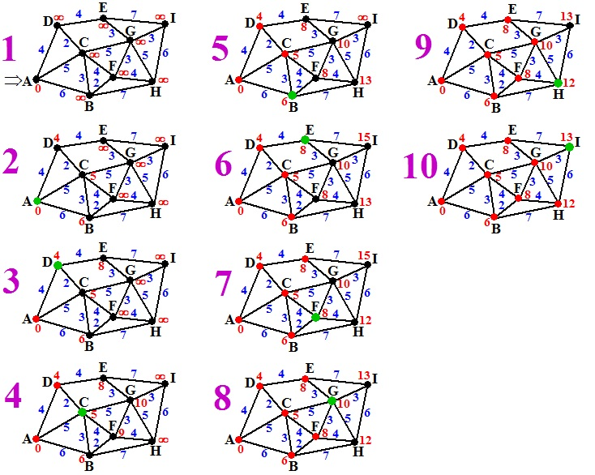
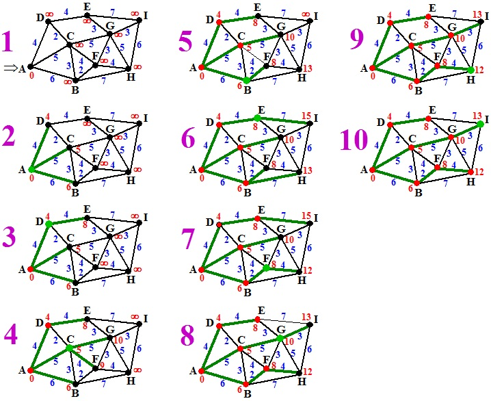

# Hoe ga je te werk

**Maak een fork van deze repo én een aparte branch waarin je aan de oplossing voor de opdracht kan werken. Wanneer je de opdracht gemaakt hebt kun je een pull-request maken naar de main branch. Tijdens het gesprek zul je samen met developers door deze pull-request heen gaan.**

Er staat alvast een methode klaar in **Algorithm.cs**: **ShortestPath**(Graph graph, Node from, Node to). De bedoeling is dat je deze methode invulling gaat geven met het algoritme.

# "De kortste route"-algoritme

Een gewogen graaf is een graaf waarvan aan de verbindingslijnen getallen zijn verbonden. Je zou het kunnen zien als de afstanden in kilometers.
Een interessante vraagt is dan natuurlijk **"Wat is de kortste afstand tussen A en B?"**

Het algoritme werkt als volgt:

A. Geef de beginknoop voorlopig afstand 0 (dat noemen we de huidige knoop) en alle andere knopen voorlopige afstand ∞ (die noemen we niet-bezochte knopen).

B. Bekijk alle directe buren van de huidige knoop. Voor elk van die knopen kun je twee afstanden vinden:

1.  de voorlopige afstand die er al bij staat
2.  de voorlopige afstand van de huidige knoop plus de lengte van de verbindingslijn vanaf de huidige knoop naar deze

Kies de kortste afstand van beiden. Dat wordt de nieuwe voorlopige afstand van deze knoop.

C. Als je alle buurknopen hebt gehad wordt de huidige knoop nu een bezochte knoop.
Kies als nieuwe huidige knoop de knoop met de kleinste voorlopige afstand.
Ga weer naar stap B.

---

### _Voorbeeld:_

In deze plaatjes 1 t/m 10 zie je hoe je het in zijn werk gaat. De groene knoop is de huidige, de rode zijn bezochte knopen, de zwarte zijn niet-bezochte knopen. De blauwe getallen geven de lengte van de verbindingslijn, de rode getallen geven de voorlopige kortste afstand tot de knoop.

1. Kies A als startknoop, geef die afstand 0, en alle anderen afstand ∞
2. De buren B, C, D krijgen afstanden 6, 5, 4.
3. A wordt een bezochte knoop, D wordt de huidige knoop. E wordt 4 + 4 = 8. C zou 4 + 2 = 6 worden, maar dat is meer dan 5 dus C blijft 5.
4. D wordt een bezochte knoop, C wordt de huidige knoop. G wordt 5 + 5 = 10, F wordt 5 + 4 = 9, B zou 5 + 3 = 8 worden, maar is al 6, dus blijft 6.
5. C wordt een bezochte knoop, B wordt de huidige knoop. F wordt 6 + 2 = 8, H wordt 6 + 7 = 13
6. B wordt bezochte knoop, E wordt de huidige knoop. I wordt 8 + 7 = 15. G zou 8 + 3 = 11 worden, maar is al 10 dus blijft 10.
7. E wordt bezochte knoop, F wordt huidige knoop. H wordt 8 + 4 = 12. G zou 8 + 3 = 11 worden, maar is al 10 dus blijft 10.
8. F wordt bezochte knoop, G wordt huidige knoop. I wordt 10 + 3 = 13. H zou 10 + 5 = 15 worden, maar is al 12, dus blijft 12.
9. G wordt bezochte knoop, H wordt huidige knoop. I zou 12 + 8 = 18 worden, maar is al 13, dus blijft 13.
10. KLAAR!

Op deze manier vind je van alle andere knopen de minimale afstand tot knoop A. Merk nog even op dat je niet vindt welke route die afstand oplevert. Als je die "beste routes" ook wilt weten kun je elke keer dat je het getal van een knoop verandert bijhouden vanaf welke knoop je tot die kortere afstand bent gekomen.
Hieronder geeft dat de groene optimale routes.
